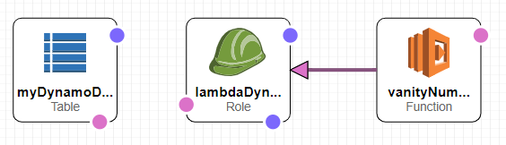

# Lukes VoiceFoundry Project
## Overview

This repo is part of a coding assignment to make use of AWS Connect, Lambda and DynamoDB.

**Testable Connect Phone Number: 1-877-583-0450**

**NOTE:** Ones and zeros cannot be entered when testing the contact flow. The 
code logic does not account for these scenarios and will throw an error.

## The Conversion Lambda
### Tasks
1. Create an AWS Lambda function that converts phone numbers to vanity numbers.
2. Save the 5 best resulting numbers along with the customer's
phone number.

### Solution
I chose to convert the last 4 digits of the phone numbers to vanity numbers 
using a backtracking algorithm. While the algorithm can convert a 7 digit
number, I kept it simple to not overload the lambda function and outputs.
In production, it would be ideal to have logic that would handle more numbers
and scenarios. 

For the 5 best resulting numbers, my thought was to find memorable words.
I decided the best way to do that was to look for words that don't start with
 vowels and have vowels every other letter.

The file *vanity_number_generator_test.js* contains an example of the 
algorithm that can be ran in NodeJS. 

The full solution is inside the CloudFormation template and
can be seen in the file *vanity-number-generator-cloudformation.yaml*.

## Amazon Connect Contact Flow

### Tasks
1. Create a contact flow that looks at the caller's number and says the
3 vanity possiblities that return from the lambda function. 

### Solution
The contact flow uses a **Store customer input** flow that prompts the 
caller for a ten digit phone number. The input is passed to an 
**Invoke AWS Lambda function** flow and then a **Play prompt** to read back the 
3 vaninty phone numbers from the conversion. Once the end of the flow is 
reached, the call disconnects. 

The 3 vanity numbers returned are the first 3 resulting numbers returned 
by the algorithm.  

### Instructions
1. Use the CloudFormation template to create a stack.
2. In Amazon Connect (assuming an instance and phone number has been
created already), select the alias link > contact flows > aws lambda > 
add the function from the list.
3. Import the provided *Luke's Vanity Number Flow* provided in this repo.
4. If needed, configure the Invoke AWS Lambda function to use the newly 
created function.
5. Associate the phone number with the imported contact flow. 

## Deployment Package

### Tasks
1. Build a deployment package with CloudFormation to allow a user, or 
assigned reviewer, to deploy the solution into their own AWS Account. 

### Solution
The first block of the template creates a DynamoDB table with a 
primary and sort key. 

The second block creates a role under the policy 
AWSLambdaBasicExecutionRole and also creates an inline policy to all 
access to the DynamoDB for reading/writing. 

The last block creates a lambda function with the solution and assigns the
newly created role to it. 

The template can be uploaded through CloudFormation and leaving all 
the default selections in place. 

**NOTE:** The solution does not contain the web app additions.

## Web App
### Tasks
1. Create a web app that displays the vanity numbers from the last 5 callers.

### Solution
I created a very simple ReactJS app that is hosted as a static website on S3. 
A Lambda function that returns the results from the DynamoDB is wired to an 
API Gateway GET endpoint. 

**NOTE:** Allow a moment for the results to load. 

 [Click here to visit web app](http://vanitynumbers.com.s3-website-us-east-1.amazonaws.com)
 
 [Click here to visit the repo](https://github.com/lyaegel88/Lukes-VoiceFoundry-ReactJS-App)

## Architectural Diagram

## Final Thoughts
First thing - I learned a lot over the last few days. I feel like an 
AWS pro now!

Also, this was my first go at using many services inlcuding:
* Lambda
* DynamoDb
* Connect
* CloudFormation

I was familiar with a lot of the concepts which took me a long way. 
I did struggle with getting the template to work, especially 
when it came to referencing the new role created with the template 
 in the lambda creation. The DependsOn attribute helped with that. 
 
 The shortcuts I took were mostly with the web app. I spent so much 
 time on other areas, like CloudFormation, that I didn't have time to 
 make a better app. 
 
 If I had more time, I would have figured out a way to add the contact flow 
 to the template. AWS Connect uses a different method for creation that I 
 didn't have time to learn.  
